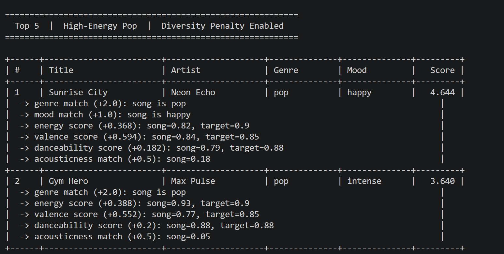
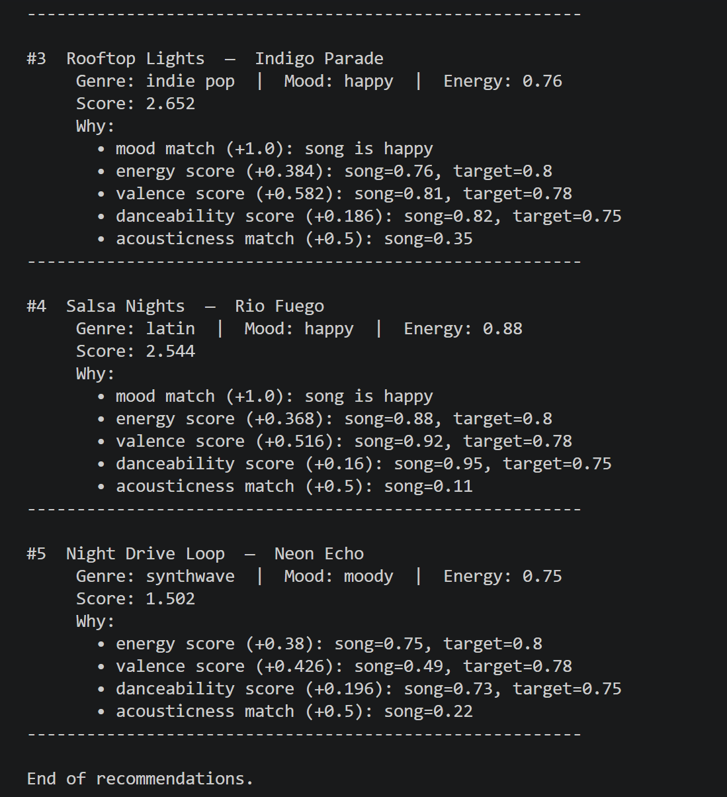
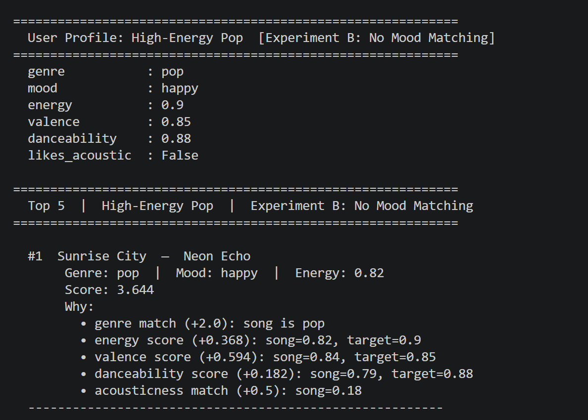
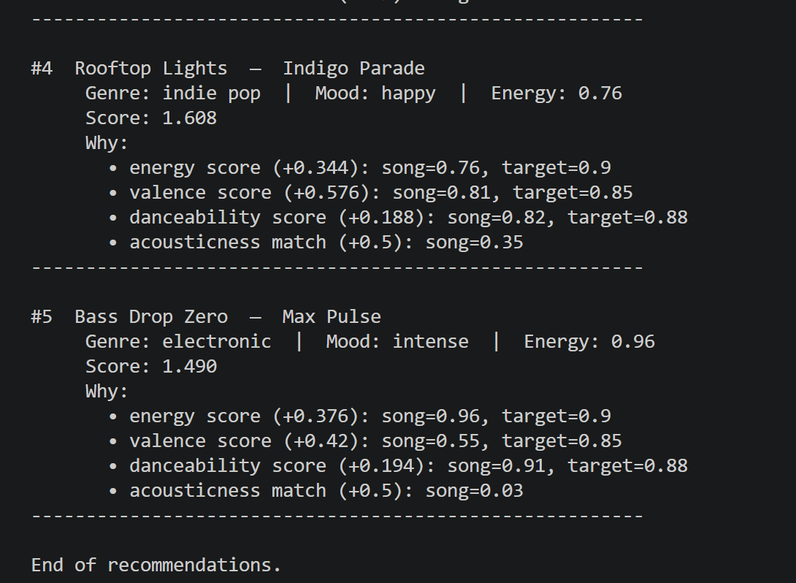
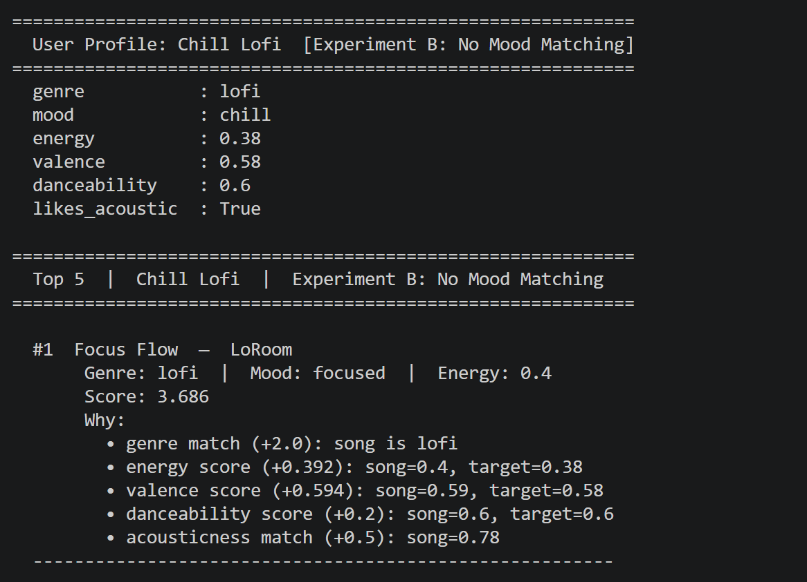
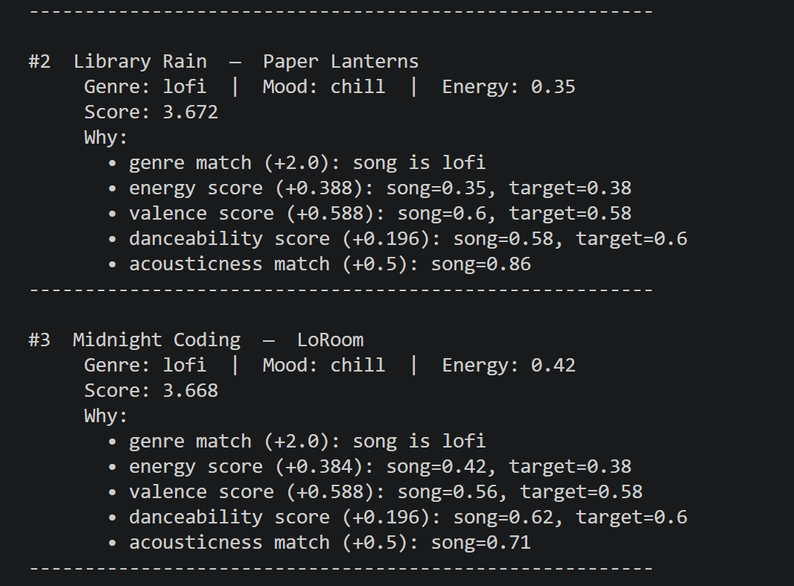
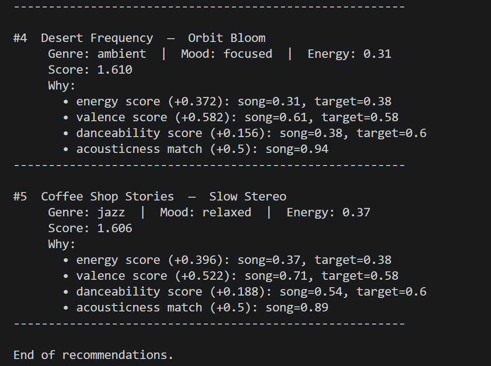
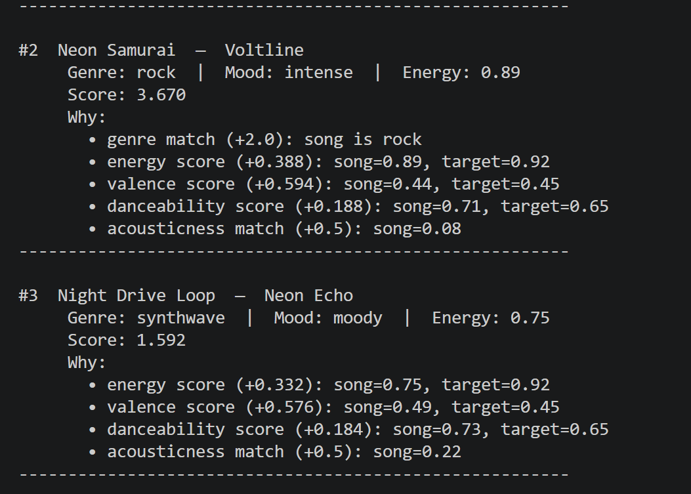
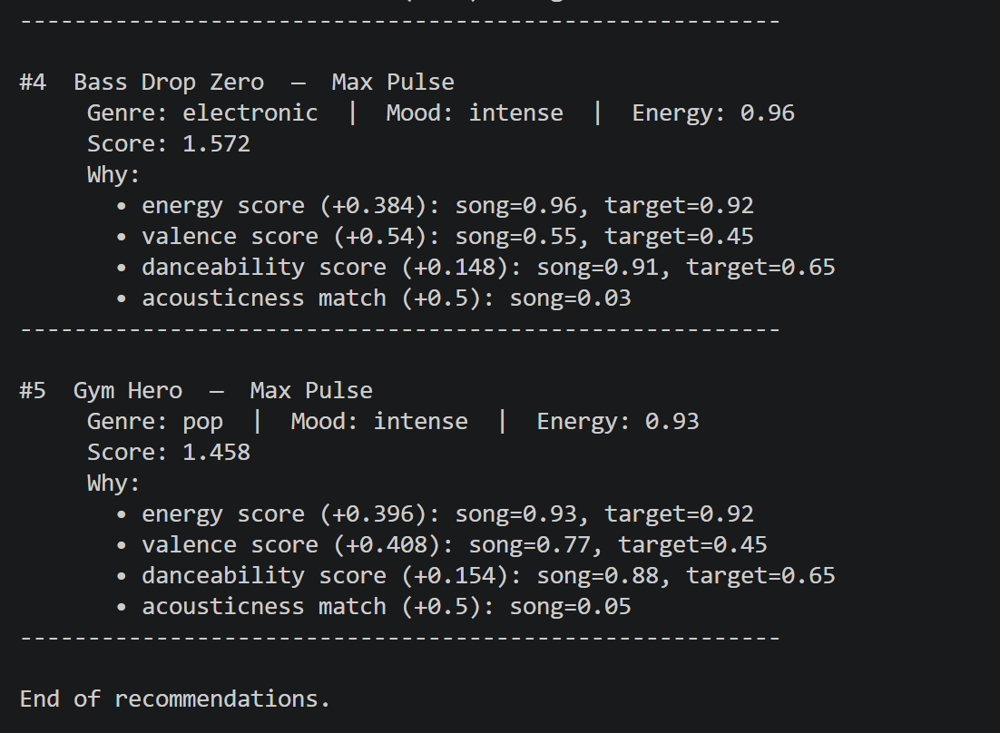

# 🎵 Music Recommender Simulation

## Project Summary

In this project you will build and explain a small music recommender system.

Your goal is to:

- Represent songs and a user "taste profile" as data
- Design a scoring rule that turns that data into recommendations
- Evaluate what your system gets right and wrong
- Reflect on how this mirrors real world AI recommenders

Replace this paragraph with your own summary of what your version does.

---

## How The System Works

Explain your design in plain language.

Some prompts to answer:

- What features does each `Song` use in your system
  - For example: genre, mood, energy, tempo
- What information does your `UserProfile` store
- How does your `Recommender` compute a score for each song
- How do you choose which songs to recommend

You can include a simple diagram or bullet list if helpful.
- Music recommendation systems such as Spotify and Pandora use a hybrid recommendation system that combines collaborative and content-based filtering. Collaborative filtering is based on other users, who have listened to the same and/or similar songs, whilst content-based filtering is based on a particular song's attribute. In this project, I'll simulating a hybrid filtering system to build a music recommendation system, as listed below:
- **Song** in the system uses the following features: `genre`, `mood`, `energy`, `tempo_bpm`, `valence`, `danceability`, and `acousticness`.

- **UserProfile** stores the user's preferred genres (supporting a mix, e.g. classical and pop), a target energy level, a target valence, a list of liked songs, liked artists, and a listening history to avoid re-recommending 
heard tracks.

- **Recommender** scores each song by measuring how close its `energy` and `valence` are to the user's preferences using the formula `1 - |song_value - user_preference|`, and then combines them with valence weighted more heavily (60/40). A genre match adds a bonus, and a liked artist adds a 
smaller affinity boost.

- Songs are **ranked** by their total score, filtered to remove already-heard songs, and the top N results are returned. Songs from a liked artist that sound noticeably different are flagged as Discovery Picks.

- Scoring system: The core scoring formula rewards **closeness to preference** rather than simply favoring high or low values. A user who prefers moderate energy will score a song at 0.75 energy higher than one at 0.30 or 1.0. Valence (musical positivity) is weighted more heavily to prioritize the emotional feel of a recommendation rather than its raw intensity.

---

## Algorithm Recipe

### Base Scoring Rule (applied to every song)

For each song in the catalog, a total score is computed against the user profile:

```
genre_score     = 2.0 if song.genre in user.preferred_genres else 0.0
mood_score      = 1.0 if song.mood in user.preferred_moods else 0.0

energy_score    = 1 - |song.energy - user.target_energy|
valence_score   = 1 - |song.valence - user.target_valence|
dance_score     = 1 - |song.danceability - user.target_danceability|

artist_boost    = 0.5 if song.artist in user.liked_artists else 0.0

total_score = genre_score
            + mood_score
            + (0.6 × valence_score)
            + (0.4 × energy_score)
            + (0.2 × dance_score)
            + artist_boost
```

**Weight rationale:**
- Genre match is weighted heaviest (2.0) — it is the strongest preference signal
- Mood match (1.0) matters but is secondary to genre
- Valence (0.6) outweighs energy (0.4) to prioritize emotional feel over intensity
- Artist boost (0.5) nudges familiar artists up without forcing them to the top

### Contextual Trigger Rule ("More Like This")

When a user finishes listening to a song, the system uses that song's genre
and mood as a temporary signal to boost similar unheard songs:

```
context_genre_bonus = 1.5 if song.genre == last_played.genre else 0.0
context_mood_bonus  = 1.0 if song.mood == last_played.mood else 0.0

contextual_score = total_score + context_genre_bonus + context_mood_bonus
```

### Artist Affinity + Discovery Rule
When a liked artist's song is played, the system checks whether it sounds
meaningfully different from what the user has already heard from that artist.
If the energy or valence differs by more than 0.2, the song is tagged as a
**Discovery Pick** and tagged with a label so the user knows it is
intentionally outside their usual comfort zone.

### Ranking Rule

```
1. Compute total_score for all songs using the Base Scoring Rule
2. Apply contextual bonuses if a last_played song exists
3. Filter out all songs in user.listened_history
4. Sort by final score descending
5. Return top N results
6. Tag any qualifying song as a Discovery Pick per the Artist Affinity rule
```

---

## Data Model

### `Song` Object

| Field | Type | Description |
|---|---|---|
| `id` | int | Unique song identifier |
| `title` | string | Song title |
| `artist` | string | Artist or band name |
| `genre` | string | Primary genre (e.g. pop, lofi, jazz) |
| `mood` | string | Descriptive mood tag (e.g. happy, chill, intense) |
| `energy` | float (0–1) | Overall intensity and activity level |
| `tempo_bpm` | int | Beats per minute |
| `valence` | float (0–1) | Musical positivity (high = happy, low = dark/sad) |
| `danceability` | float (0–1) | How suitable the track is for dancing |
| `acousticness` | float (0–1) | Likelihood the track is acoustic vs electronic |

### `UserProfile` Object

| Field | Type | Description |
|---|---|---|
| `user_id` | int | Unique user identifier |
| `name` | string | Display name |
| `preferred_genres` | list[string] | Ordered list of preferred genres (supports multiple) |
| `preferred_moods` | list[string] | Moods the user gravitates toward |
| `target_energy` | float (0–1) | Preferred energy level |
| `target_valence` | float (0–1) | Preferred emotional tone |
| `target_danceability` | float (0–1) | Preferred danceability level |
| `liked_songs` | list[int] | Song IDs the user has explicitly liked |
| `liked_artists` | list[string] | Artists the user has shown affinity for |
| `listened_history` | list[int] | Song IDs already heard (excluded from recommendations) |

---

## System Flowchart


---

## Known Biases & Limitations

**Genre over-prioritization**: because genre match carries the highest weight
(2.0 points), a song in a preferred genre will almost always outscore a
better-matching song from a similar genre, even if the latter is a
near-perfect audio fit. A great jazz track could be buried beneath a mediocre
pop song simply because the user listed pop as a preference.

**Cold-start limitation**: new users with no listening history or liked
artists will receive recommendations based on their stated preferences,
with no behavioral signal to refine results. The first few recommendations
may feel generic until history accumulates.

**Small catalog bias**: with only 20 songs, some genres and moods have only
one or two representatives. This means the system may repeatedly surface the
same songs for certain preference profiles, reducing perceived variety.

**Context window is shallow**: the contextual trigger rule only looks at the
single last-played song. A user who alternates between genres may receive
contextual boosts that conflict with their long-term listening pattern.

**No negative feedback**: the system currently has no way to penalize songs
the user has skipped or disliked. All unheard songs are treated as equally
viable candidates until explicitly added to `listened_history`.

**Score collapse on unknown preferences**: when a user's genre and mood have
no match in the catalog, total scores drop to the 1.0–1.5 range, making all
results feel equally uncertain. The system has no way to signal low confidence
or flag that recommendations are essentially blind guesses in this scenario.
---
## Sample CLI Output 



## Profile Test Screenshot

### High-Energy Pop


### Chill Lofi


### Deep Intense Rock


### Edge Case: High Energy + Melancholic Mood


### Edge Case:  Conflicting Acoustic + Electronic


### Edge Case: No Genre or Mood Match


## Data Experiment Baseline Result
### High-Energy Pop


### Chill Lofi


### Deep Intense Rock


## Experiment A: Weight Shift
### High-Energy Pop


### Chill Lofi


### Deep Intense Rock


## Experiment B: No Mood Matching
### High-Energy Pop




### Chill Lofi




### Deep Intense Rock




## Getting Started

### Setup

1. Create a virtual environment (optional but recommended):

   ```bash
   python -m venv .venv
   source .venv/bin/activate      # Mac or Linux
   .venv\Scripts\activate         # Windows

2. Install dependencies

```bash
pip install -r requirements.txt
```

3. Run the app:

```bash
python -m src.main
```

### Running Tests

Run the starter tests with:

```bash
pytest
```

You can add more tests in `tests/test_recommender.py`.

---

## Experiments You Tried

Use this section to document the experiments you ran. For example:

- What happened when you changed the weight on genre from 2.0 to 0.5
- What happened when you added tempo or valence to the score
- How did your system behave for different types of users

---

## Limitations and Risks

Summarize some limitations of your recommender.

Examples:

- It only works on a tiny catalog
- It does not understand lyrics or language
- It might over favor one genre or mood

You will go deeper on this in your model card.

---

## Reflection

Read and complete `model_card.md`:

[**Model Card**](model_card.md)

Write 1 to 2 paragraphs here about what you learned:

- about how recommenders turn data into predictions
- about where bias or unfairness could show up in systems like this


---

## 7. `model_card_template.md`

Combines reflection and model card framing from the Module 3 guidance. :contentReference[oaicite:2]{index=2}  

```markdown
# 🎧 Model Card - Music Recommender Simulation

## 1. Model Name

Give your recommender a name, for example:

> VibeFinder 1.0

---

## 2. Intended Use

- What is this system trying to do
- Who is it for

Example:

> This model suggests 3 to 5 songs from a small catalog based on a user's preferred genre, mood, and energy level. It is for classroom exploration only, not for real users.

---

## 3. How It Works (Short Explanation)

Describe your scoring logic in plain language.

- What features of each song does it consider
- What information about the user does it use
- How does it turn those into a number

Try to avoid code in this section, treat it like an explanation to a non programmer.

---

## 4. Data

Describe your dataset.

- How many songs are in `data/songs.csv`
- Did you add or remove any songs
- What kinds of genres or moods are represented
- Whose taste does this data mostly reflect

---

## 5. Strengths

Where does your recommender work well

You can think about:
- Situations where the top results "felt right"
- Particular user profiles it served well
- Simplicity or transparency benefits

---

## 6. Limitations and Bias

Where does your recommender struggle

Some prompts:
- Does it ignore some genres or moods
- Does it treat all users as if they have the same taste shape
- Is it biased toward high energy or one genre by default
- How could this be unfair if used in a real product

---

## 7. Evaluation

How did you check your system

Examples:
- You tried multiple user profiles and wrote down whether the results matched your expectations
- You compared your simulation to what a real app like Spotify or YouTube tends to recommend
- You wrote tests for your scoring logic

You do not need a numeric metric, but if you used one, explain what it measures.

---

## 8. Future Work

If you had more time, how would you improve this recommender

Examples:

- Add support for multiple users and "group vibe" recommendations
- Balance diversity of songs instead of always picking the closest match
- Use more features, like tempo ranges or lyric themes

---

## 9. Personal Reflection

A few sentences about what you learned:

- What surprised you about how your system behaved
- How did building this change how you think about real music recommenders
- Where do you think human judgment still matters, even if the model seems "smart"

