# 🎵 Music Recommender Simulation

## Project Summary
- This music recommender system allows a user to pick a song based on preference and have suggestions made based on the music chosen. The first song the user selects will be used as a baseline to allow the recommender system suggest similar songs that are of the same genre. The system works in a similar fashion to real-world applications such as Spotify and YouTube. Spotify and YouTube suggest songs/videos based on the users previous choices and it is able to suggest new songs/videos, if it is similar to ones already listened to and/or viewed. Since the sample songs used in the project are few, 20 in number, the result obtained seems to favor high-energy pop music. 

---

## How The System Works
- Music recommendation systems such as Spotify and Pandora use a hybrid recommendation system that combines collaborative and content-based filtering. Collaborative filtering is based on other users, who have listened to the same and/or similar songs, whilst content-based filtering is based on a particular song's attribute. In this project, I'll simulating a hybrid filtering system to build a music recommendation system, as listed below:
- **Song** in the system uses the following features: `genre`, `mood`, `energy`, `tempo_bpm`, `valence`, `danceability`, and `acousticness`.

- **UserProfile** stores the user's preferred genres (supporting a mix, e.g. classical and pop), a target energy level, a target valence, a list of liked songs, liked artists, and a listening history to avoid re-recommending 
heard tracks.

- **Recommender** scores each song by measuring how close its `energy` and `valence` are to the user's preferences using the formula `1 - |song_value - user_preference|`, and then combines them with valence weighted more heavily (60/40). A genre match adds a bonus, and a liked artist adds a 
smaller affinity boost.

- Songs are **ranked** by their total score, filtered to remove already-heard songs, and the top N results are returned. Songs from a liked artist that sound noticeably different are flagged as Discovery Picks.

- Scoring system: The core scoring formula rewards **closeness to preference** rather than simply favoring high or low values. A user who prefers moderate energy will score a song at 0.75 energy higher than one at 0.30 or 1.0. Valence (musical positivity) is weighted more heavily to prioritize the emotional feel of a recommendation rather than its raw intensity.

---

## Algorithm Recipe

### Base Scoring Rule (applied to every song)

For each song in the catalog, a total score is computed against the user profile:

```
genre_score     = 2.0 if song.genre in user.preferred_genres else 0.0
mood_score      = 1.0 if song.mood in user.preferred_moods else 0.0

energy_score    = 1 - |song.energy - user.target_energy|
valence_score   = 1 - |song.valence - user.target_valence|
dance_score     = 1 - |song.danceability - user.target_danceability|

artist_boost    = 0.5 if song.artist in user.liked_artists else 0.0

total_score = genre_score
            + mood_score
            + (0.6 × valence_score)
            + (0.4 × energy_score)
            + (0.2 × dance_score)
            + artist_boost
```

**Weight rationale:**
- Genre match is weighted heaviest (2.0) — it is the strongest preference signal
- Mood match (1.0) matters but is secondary to genre
- Valence (0.6) outweighs energy (0.4) to prioritize emotional feel over intensity
- Artist boost (0.5) nudges familiar artists up without forcing them to the top

### Contextual Trigger Rule ("More Like This")

When a user finishes listening to a song, the system uses that song's genre
and mood as a temporary signal to boost similar unheard songs:

```
context_genre_bonus = 1.5 if song.genre == last_played.genre else 0.0
context_mood_bonus  = 1.0 if song.mood == last_played.mood else 0.0

contextual_score = total_score + context_genre_bonus + context_mood_bonus
```

### Artist Affinity + Discovery Rule
When a liked artist's song is played, the system checks whether it sounds
meaningfully different from what the user has already heard from that artist.
If the energy or valence differs by more than 0.2, the song is tagged as a
**Discovery Pick** and tagged with a label so the user knows it is
intentionally outside their usual comfort zone.

### Ranking Rule

```
1. Compute total_score for all songs using the Base Scoring Rule
2. Apply contextual bonuses if a last_played song exists
3. Filter out all songs in user.listened_history
4. Sort by final score descending
5. Return top N results
6. Tag any qualifying song as a Discovery Pick per the Artist Affinity rule
```

---

## Data Model

### `Song` Object

| Field | Type | Description |
|---|---|---|
| `id` | int | Unique song identifier |
| `title` | string | Song title |
| `artist` | string | Artist or band name |
| `genre` | string | Primary genre (e.g. pop, lofi, jazz) |
| `mood` | string | Descriptive mood tag (e.g. happy, chill, intense) |
| `energy` | float (0–1) | Overall intensity and activity level |
| `tempo_bpm` | int | Beats per minute |
| `valence` | float (0–1) | Musical positivity (high = happy, low = dark/sad) |
| `danceability` | float (0–1) | How suitable the track is for dancing |
| `acousticness` | float (0–1) | Likelihood the track is acoustic vs electronic |

### `UserProfile` Object

| Field | Type | Description |
|---|---|---|
| `user_id` | int | Unique user identifier |
| `name` | string | Display name |
| `preferred_genres` | list[string] | Ordered list of preferred genres (supports multiple) |
| `preferred_moods` | list[string] | Moods the user gravitates toward |
| `target_energy` | float (0–1) | Preferred energy level |
| `target_valence` | float (0–1) | Preferred emotional tone |
| `target_danceability` | float (0–1) | Preferred danceability level |
| `liked_songs` | list[int] | Song IDs the user has explicitly liked |
| `liked_artists` | list[string] | Artists the user has shown affinity for |
| `listened_history` | list[int] | Song IDs already heard (excluded from recommendations) |

---

## System Flowchart

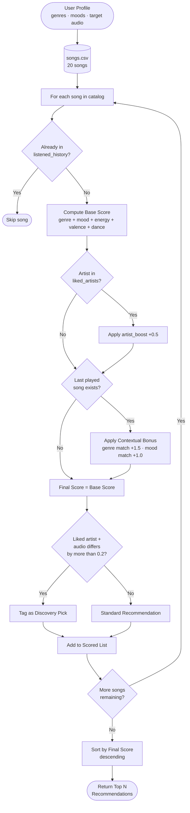

---

## Known Biases & Limitations

**Genre over-prioritization**: because genre match carries the highest weight
(2.0 points), a song in a preferred genre will almost always outscore a
better-matching song from a similar genre, even if the latter is a
near-perfect audio fit. A great jazz track could be buried beneath a mediocre
pop song simply because the user listed pop as a preference.

**Cold-start limitation**: new users with no listening history or liked
artists will receive recommendations based on their stated preferences,
with no behavioral signal to refine results. The first few recommendations
may feel generic until history accumulates.

**Small catalog bias**: with only 20 songs, some genres and moods have only
one or two representatives. This means the system may repeatedly surface the
same songs for certain preference profiles, reducing perceived variety.

**Context window is shallow**: the contextual trigger rule only looks at the
single last-played song. A user who alternates between genres may receive
contextual boosts that conflict with their long-term listening pattern.

**No negative feedback**: the system currently has no way to penalize songs
the user has skipped or disliked. All unheard songs are treated as equally
viable candidates until explicitly added to `listened_history`.

**Score collapse on unknown preferences**: when a user's genre and mood have
no match in the catalog, total scores drop to the 1.0–1.5 range, making all
results feel equally uncertain. The system has no way to signal low confidence
or flag that recommendations are essentially blind guesses in this scenario.

---
## Sample CLI Output

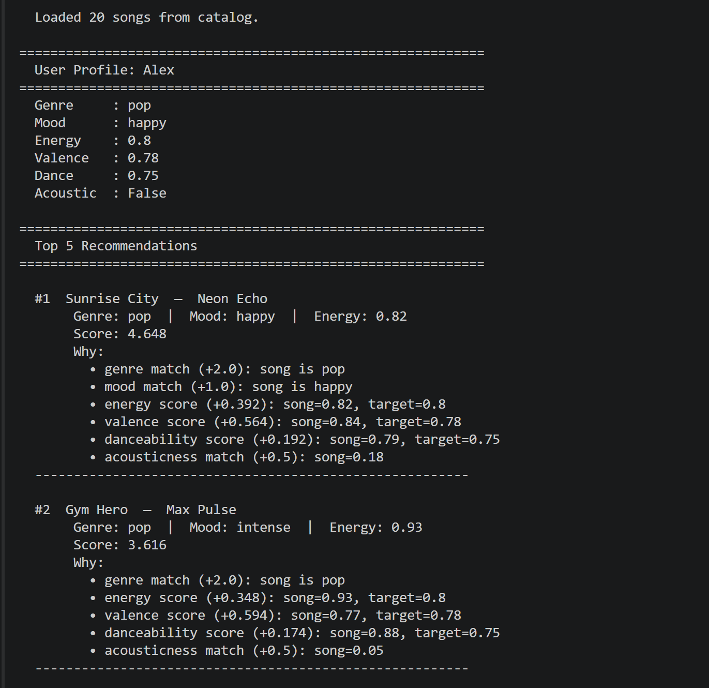

---

## Profile Test Screenshots

### High-Energy Pop
| Baseline | Experiment A | Experiment B |
|---|---|---|
| 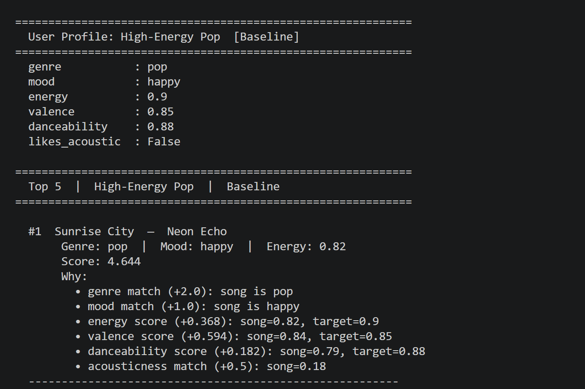 | 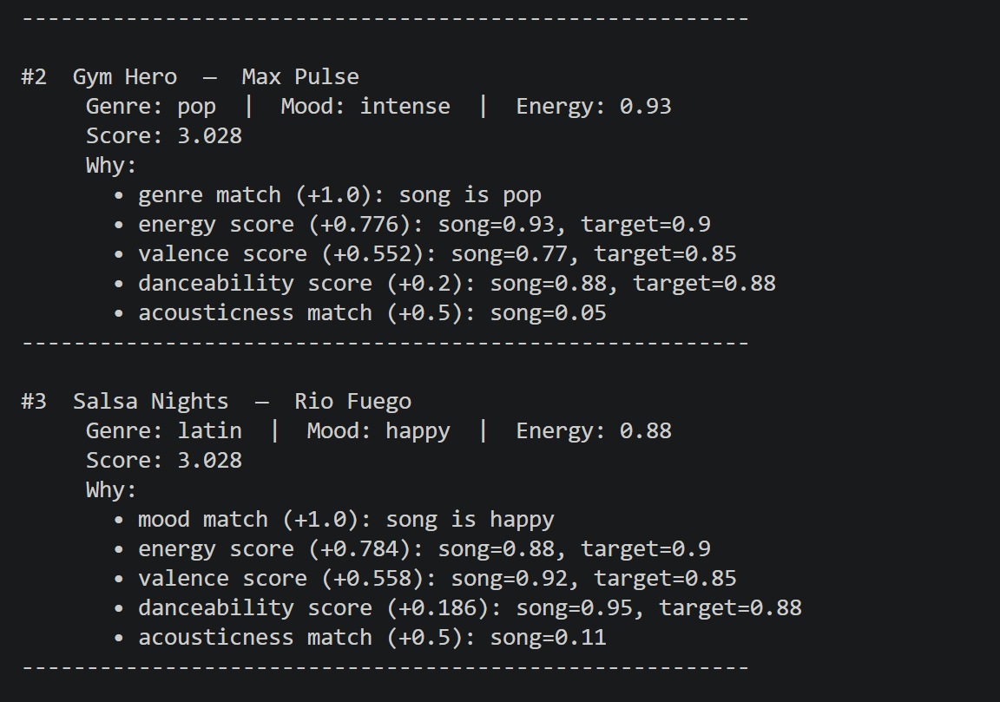 |  |

### Chill Lofi
| Baseline | Experiment A | Experiment B |
|---|---|---|
| 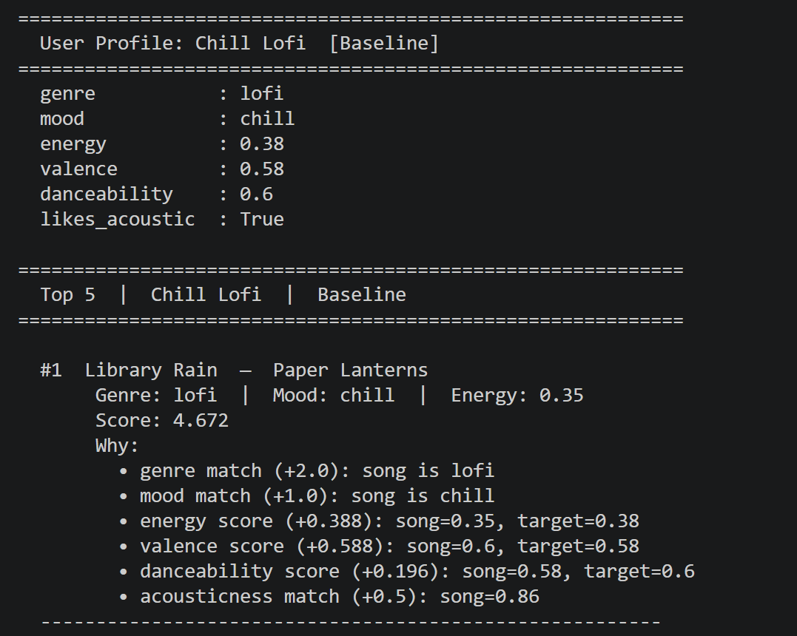 | 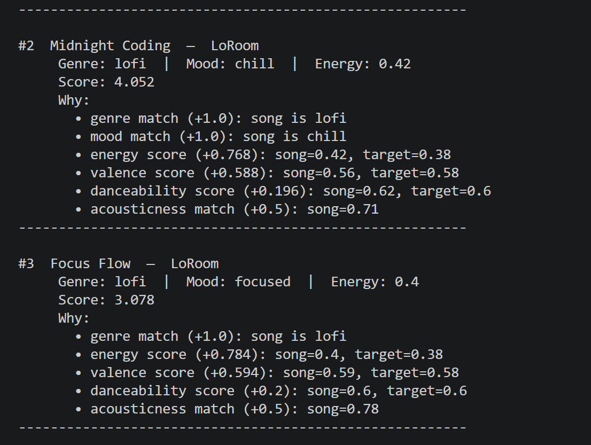 |  |

### Deep Intense Rock
| Baseline | Experiment A | Experiment B |
|---|---|---|
| 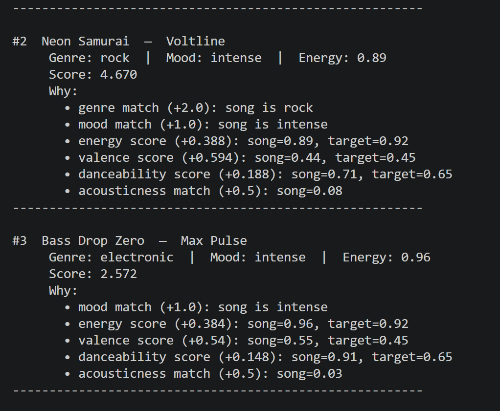 | 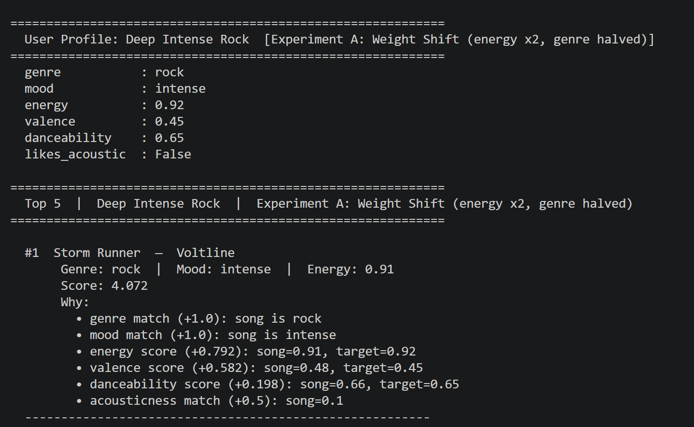 | 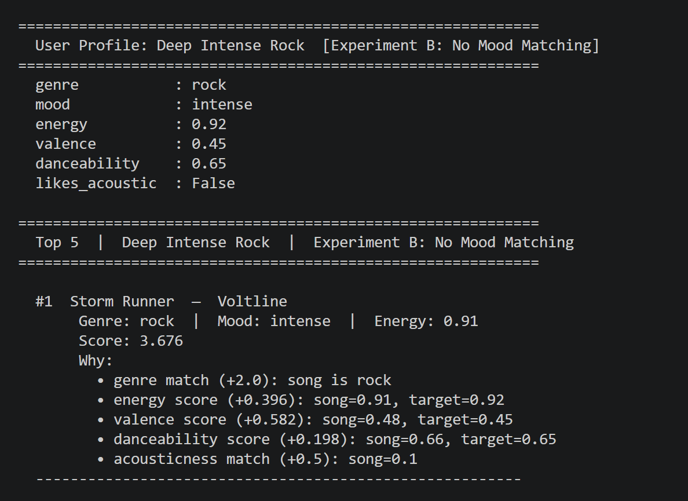 |

### Edge Case: High Energy + Melancholic Mood
| Result |
|---|
| 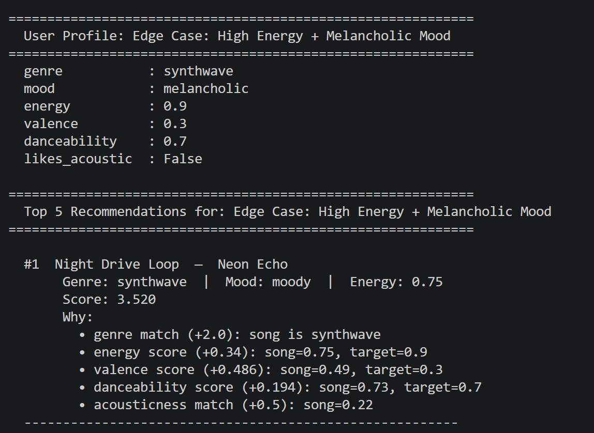 |

### Edge Case: Conflicting Acoustic + Electronic
| Result |
|---|
| 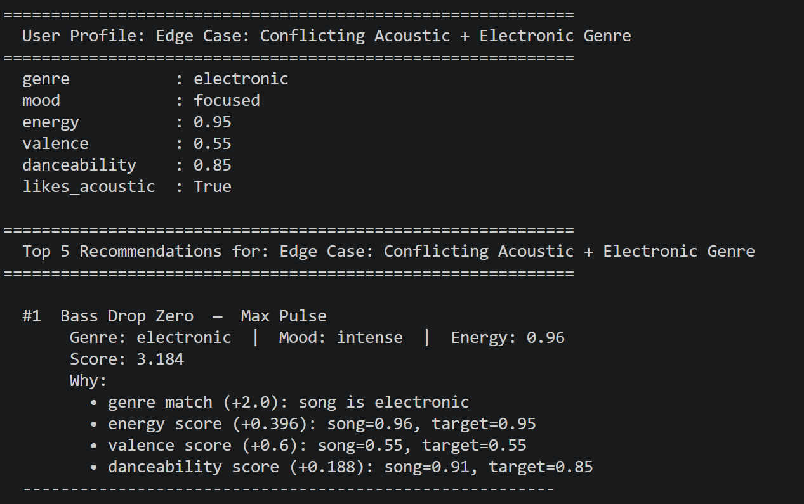 |

## Getting Started

### Setup

1. Create a virtual environment (optional but recommended):

   ```bash
   python -m venv .venv
   source .venv/bin/activate      # Mac or Linux
   .venv\Scripts\activate         # Windows

2. Install dependencies

```bash
pip install -r requirements.txt
```

3. Run the app:

```bash
python -m src.main
```

### Running Tests

Run the starter tests with:

```bash
pytest
```

You can add more tests in `tests/test_recommender.py`.

---

## Experiments You Tried
- In this model, two experiments were tested, weight shift and mood matching. For the experiment involving weight shift, genre and energy was reduced to 1.0 and 0.8 respectively. This was done so that songs with near energy match can climb in rankings even though it's not from a genre the user prefers. In the experimenting with mood, removing mood means that song rankings that matched a particular mood was decreased whilst songs with better audio feature scores, but the wrong mood will increase. For example, the Chill Lofi profile, Focus Flow (focused, not chill) may now outscore Library Rain (chill) since mood was the only thing separating them.
---

## Limitations and Risks
- The main limitation is the number of songs and type of songs generated. Since the songs were auto-generated, the variety of songs was based off of the songs already present in songs.csv folder. Consequently, AI (Claude) matched the songs generated accordingly. Furthermore, the total number of songs used in the project is small; total number of songs is 20. Therefore, not all genre of music was analyzed for the project. 

---

## Reflection

Read and complete `model_card.md`:

[**Model Card**](model_card.md)

- In general, I learned that applications such as Spotify and YouTube use a complicated scoring system to generate suggestions based on a user's profile. For instance, if a user likes to listen to podcasts that relates to sciences, it will based its suggestions based on 'commonly listened to' programs, so as to match the user's preferences. Based on a scoring system, this can lead to bias, since similar genre may not be suggested, as it is not an exact match to the user's profile preference(s). 
---

## 7. `model_card_template.md`

Combines reflection and model card framing from the Module 3 guidance. :contentReference[oaicite:2]{index=2}  

```markdown
# 🎧 Model Card - Music Recommender Simulation

## 1. Model Name
> MusicMatch 1.0
---

## 2. Intended Use
- The intended use for this recommender system is for educational purposes only. It is meant to mimic real recommender systems such as Spotify. The user can modify the songs used in the project to reflect his/her personal taste. 
---

## 3. How It Works (Short Explanation)
- Some of the features in this recommender system include genre, energy, danceability and mood, with each having scores that helps group songs that are similar together. For example, a high-energy pop song, which has high energy score and danceability, is ranked higher than a song that isn't. Therefore, if a users selects a song, the recommender will generate a score based on the song's similarity to a song the user has previously listened to. However, if it is the user's first time listening to the song, it will be used as a baseline for other songs in same genre that have the same and/or similar characteristics

---

## 4. Data
- The total number of songs in songs.csv file is 20. I added additional 10 songs to the songs already present in the file. The genre represented in the data set include high-energy pop, and deep intense rock, which is what is represented in the song choice used in the project. 
---

## 5. Strengths
- The recommender was great in recommending songs based on the user preference. For instance, high-energy pop songs, seems to be popular with the user. Since the songs used in the project are small, it means that the same can be applied to real-world situations. Consequently, expanding the genre explored in the project can assist in creating a more accurate user profile that can be tailored to each user. 
---

## 6. Limitations and Bias
- In general, I noticed that the recommender seems to favor, high-energy pop songs. Every iteration seems to give high-energy pop preference over other genre of music. The recommender assumes that the user always wants to listen to high-energy pop first. all experiments and iterations gave preference to high-energy pop over others. Since the number of songs is small, results produced favors high-energy pop. I think if the number of genre and songs was increased, the result obtained may become evenly spread out amongst each genre of music in the songs file.
---

## 7. Evaluation
- In experimenting, I changed the genre score and mood to note any difference in each user profile. However, the changes did not produce any significant difference, for it favored one genre, high-energy pop, over others. This means that this recommender is heavily skewed to one form of genre, high-energy pop. 

---

## 8. Future Work
- In the future, I'd like to use real songs to test how it would perform as compared to auto-generated songs. In addition, I will increase the number and variety of songs used in the project. This allows testing to note if there's any significant difference from the original classification of a song to the result obtained when the recommender is used. 
---

## 9. Personal Reflection
- One of the most important lesson learned from this project is that recommender systems, such as Spotify, YouTube, and Pandora, are very complicated. Such platforms analyze lots of datapoints to be able to recommend potential songs/ videos that may be of interest as well as suggest songs/videos the user maybe interested in. In addition, I think the human factor is still important to allow the recommender system to function properly. If a users seems to be interested in a particular kind of song and/or topic doesn't mean that the user(human) can't listen to or watch videos that the user may not have previously considered. I think recommender systems in general still needs 'human element' to function effectively.

# Challenges 3 and 4  Prompts
Challenge 3: Diversity and Fairness Logic
Implement a "Diversity Penalty" that prevents the recommender from suggesting too many songs from the same artist or genre in the top results.

# Challenge 4
Challenge 4: Visual Summary Table
Improve the readability of your terminal output by providing a formatted table or summary.

## Sample Results
*** refer to model_card.md for image display 


