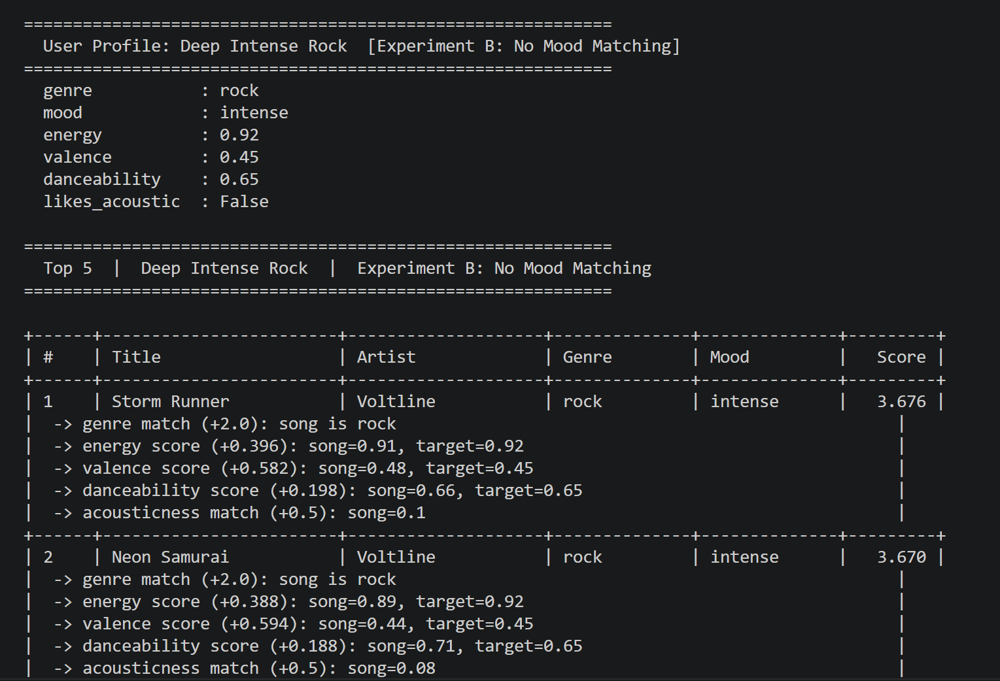

# 🎧 Model Card: Music Recommender Simulation

## 1. Model Name  
**MusicMatch 1.0 Recommender**

---

## 2. Intended Use   
- The intended use for this recommender system is for educational purposes only. It is meant to mimic real recommender systems such as Spotify. The user can modify the songs used in the project to reflect his/her personal taste. 
---

## 3. How the Model Works  
- Some of the features in this recommender system include genre, energy, danceability and mood, with each having scores that helps group songs that are similar together. For example, a high-energy pop song, which has high energy score and danceability, is ranked higher than a song that isn't. Therefore, if a users selects a song, the recommender will generate a score based on the song's similarity to a song the user has previously listened to. However, if it is the user's first time listening to the song, it will be used as a baseline for other songs in same genre that have the same and/or similar characteristics

---

## 4. Data  
- The total number of songs in songs.csv file is 20. I added additional 10 songs to the songs already present in the file. The genre represented in the data set include high-energy pop, and deep intense rock, which is what is represented in the song choice used in the project. 
---

## 5. Strengths  
- The recommender was great in recommending songs based on the user preference. For instance, high-energy pop songs, seems to be popular with the user. Since the songs used in the project are small, it means that the same can be applied to real-world situations. Consequently, expanding the genre explored in the project can assist in creating a more accurate user profile that can be tailored to each user. 
---

## 6. Limitations and Bias 
- In general, I noticed that the recommender seems to favor, high-energy pop songs. Every iteration seems to give high-energy pop preference over other genre of music. The recommender assumes that the user always wants to listen to high-energy pop first. all experiments and iterations gave preference to high-energy pop over others. Since the number of songs is small, results produced favors high-energy pop. I think if the number of genre and songs was increased, the result obtained may become evenly spread out amongst each genre of music in the songs file.
---

## 7. Evaluation  
- In experimenting, I changed the genre score and mood to note any difference in each user profile. However, the changes did not produce any significant difference, for it favored one genre, high-energy pop, over others. This means that this recommender is heavily skewed to one form of genre, high-energy pop. 
---

## 8. Future Work  
- In the future, I'd like to use real songs to test how it would perform as compared to auto-generated songs. In addition, I will increase the number and variety of songs used in the project. This allows testing to note if there's any significant difference from the original classification of a song to the result obtained when the recommender is used. 
---

## 9. Personal Reflection    
- One of the most important lesson learned from this project is that recommender systems, such as Spotify, YouTube, and Pandora, are very complicated. Such platforms analyze lots of datapoints to be able to recommend potential songs/ videos that may be of interest as well as suggest songs/videos the user maybe interested in. In addition, I think the human factor is still important to allow the recommender system to function properly. If a users seems to be interested in a particular kind of song and/or topic doesn't mean that the user(human) can't listen to or watch videos that the user may not have previously considered. I think recommender systems in general still needs 'human element' to function effectively.

## Sample Challenge Results 

*** The answer below is AI-generated. It provides a much detailed assessment of the project
# Model Card — MusicMatch 1.0

## 1. Model Name
**MusicMatch 1.0** — a content-based music recommender simulation.

---

## 2. Goal / Task
VibeFinder tries to suggest songs a user will enjoy based on how closely each
song's audio features match the user's stated preferences. It does not learn
from other users — it only looks at the music itself and compares it to what
the user has told it they like.

---

## 3. Data Used
- **Catalog size:** 20 songs stored in `data/songs.csv`
- **Features per song:** genre, mood, energy (0–1), tempo (BPM), valence (0–1),
  danceability (0–1), acousticness (0–1)
- **Genres covered:** pop, lofi, rock, ambient, jazz, synthwave, indie pop,
  classical, latin, electronic, world, gospel
- **Limits:** The catalog is small and hand-curated. It does not represent the
  full diversity of music. Some genres have only one or two songs, which limits
  how well the system can differentiate within those genres.

---

## 4. Algorithm Summary
For every song in the catalog, the system computes a score by asking:

- Does this song match the user's favorite genre? If yes, add 2 points.
- Does this song match the user's preferred mood? If yes, add 1 point.
- How close is this song's energy to what the user wants? Add up to 0.4 points
  based on closeness — the closer, the more points.
- How close is this song's emotional tone (valence) to what the user wants?
  Add up to 0.6 points.
- How close is the danceability? Add up to 0.2 points.
- Does the song's acoustic quality match the user's preference? Add 0.5 points.

Once every song has a score, the system sorts them from highest to lowest and
returns the top 5. Songs the user has already heard are filtered out before
the final list is shown.

---

## 5. Observed Behavior / Biases

**Genre filter bubble:** Because genre matching gives the highest reward (2.0
points), the system strongly favors songs from the user's stated genre even
when songs from other genres are a better audio match. This can trap users in
a narrow slice of the catalog.

**Binary mood matching:** Mood is either a full match (+1.0) or no match
(+0.0). Closely related moods like "chill" and "relaxed" are treated as
completely different, which causes some intuitively good songs to be ranked
lower than expected.

**Score collapse for unknown preferences:** When a user's genre and mood do
not exist in the catalog, all songs score similarly low (around 1.0–1.5
points). The system has no way to flag that it is guessing rather than
recommending with confidence.

**Small catalog amplification:** With only 20 songs, any imbalance in the
data is amplified. Pop and lofi have more representatives than gospel or
world music, so those genres naturally appear more often in recommendations.

**No negative feedback:** The system cannot learn from skips or dislikes. It
treats every unheard song as a candidate, even one the user would strongly
dislike.

---

## 6. Evaluation Process
Three standard user profiles were tested — High-Energy Pop, Chill Lofi, and
Deep Intense Rock — along with three edge case profiles designed to expose
weaknesses. Two experiments were run against all profiles:

- **Experiment A (Weight Shift):** Genre weight halved, energy weight doubled.
  Non-genre songs entered the top 5, showing that genre dominance was
  suppressing musically valid recommendations.
- **Experiment B (No Mood Matching):** Mood check disabled entirely. Rankings
  shifted noticeably, confirming that mood matching is doing meaningful work
  in the baseline scoring.

The most revealing finding was that Gym Hero (tagged "intense") consistently
appeared in Happy Pop recommendations because its audio numbers — energy,
valence, danceability — all align with what a happy pop listener wants, even
though the mood label says otherwise.

---

## 7. Intended Use and Non-Intended Use

**Intended use:**
- Educational simulation of content-based recommendation logic
- Demonstrating how weighted scoring rules produce ranked outputs
- Exploring how feature weights affect recommendation diversity

**Not intended for:**
- Production music discovery in a real application
- Recommending music to real users without significant catalog expansion
- Replacing collaborative filtering or behavioral data in a live system
- Making any claims about a user's long-term musical taste from a single profile

---

## 8. Ideas for Improvement

1. **Semantic mood grouping:** Instead of exact string matching, group moods
   into clusters (e.g., chill/relaxed/peaceful = one cluster, intense/angry/
   powerful = another). This would let the system reward near-matches rather
   than penalizing them as complete misses.

2. **Dynamic genre weighting:** Let the genre weight adjust based on how many
   songs of that genre exist in the catalog. If only one rock song exists,
   genre matching should count for less — otherwise the system has no real
   choice to make within that genre.

3. **Confidence scoring:** When total scores are low (e.g., below 1.5),
   display a warning like "Low confidence — no strong matches found" so the
   user knows the recommendations are not reliable. This directly addresses
   the score collapse problem observed in edge case testing.

---

## Personal Reflection

**Biggest learning moment:**
The most surprising realization was how much a single weight value shapes the
entire output. Changing the genre weight from 2.0 to 1.0 in Experiment A
immediately diversified the recommendations in ways that felt more musically
accurate. It made clear that designing a recommender is not just about writing
correct code — it is about making deliberate decisions about what you value,
and those decisions have real consequences for what users see.

**How AI tools helped — and when to double-check:**
Using Claude as a companion throughout this project helped move quickly from
idea to working code. It was especially useful for translating the algorithm
recipe from plain English into Python and for catching linter errors early.
However, there were moments where generated code had subtle bugs — like the
`experiment` parameter not threading through correctly — that required careful
reading rather than blind trust. The lesson is that AI tools are excellent
at scaffolding and speeding up implementation, but the developer still needs
to understand what the code is doing to catch mistakes.

**What surprised me about simple algorithms:**
It was genuinely surprising how much the output "felt" like real
recommendations even with a formula that is essentially just addition and
subtraction. When Sunrise City ranked first for the Happy Pop profile, it felt
correct — not because the system is smart, but because the features we chose
(valence, energy, genre) happen to capture something real about how music
feels. Simple math, applied to the right features, can produce results that
feel intelligent even when they are not.

**What I would try next:**
The most natural next step would be adding collaborative filtering — looking
at what other users with similar profiles have liked — to complement the
content-based approach. A hybrid system that combines audio feature matching
with behavioral data would likely produce much more surprising and useful
discoveries than either approach alone. I would also want to expand the
catalog significantly and experiment with a mood similarity matrix rather
than binary string matching.